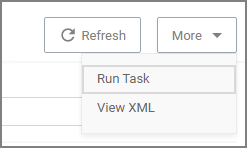
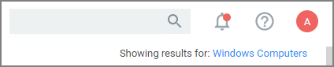

[title]: # (Navigation and Controls)
[tags]: # (menus)
[priority]: # (1)
# Navigation and Controls

In Privilege Manager navigation and controls are aligned with Thycotic's standard user experience.  The main navigation menu is situated along the left side of your browser window and controls on each page are standardized.

The button for a __page refresh__ and the __More__ drop-down options are available at the top-right of your page.

Whenever you are in editing mode on a page, you find a __Save__ or __Cancel__ banner on the top of your page.

Breadcrumb navigation is provided on the top left of your page.

## Search, Notification, Help, User Menus

Next to the search menu is the [Notification/Alerts](../alert/index.md) icon. Click the icon to Manage Approvals and to view Notifications.

The help menu provides access to About, Getting Started, Documentation, and the API Reference.

The user icon provides access to information about the system name, Preferences, and it has the Logout button.

Controls to enable or disable a setting are unified across the user interface via on/off type switches. Users preferences like number of grid rows and color theme can be specified, these will be applied through the console one edited and saved.

## Main Menu

The main navigation menu on the left is organized into

* Computer Groups
* Client System Settings
* File Inventory
* Policy Events
* [Reports](../../reports/index.md)
* Admin

### Chevrons

A menu item with a chevron indicates the menu can be opened or closed, depending on chevron direction. For example in the image below the chevron pointing down for macOS computers indicates the item is collapsed.

The chevron pointing up for Windows computers indicates the item is expanded.

## Computer Groups

The listed computer groups all have subitems organized by

* [Application Policies](../../app-control/policies/index.md)
* [User Policies](../../local-security/index.md)
* [Group Policies](../../local-security/index.md)
* [Scheduled Jobs](../../tasks/client/index.md)
* [Agent Configuration](../../agents/index.md)

## Admin Menu

The Admin menu provides access to Tools, like

* [Disclose Password](../../tools/pw-disclosure.md)
* [Manage Approvals](../../app-control/examples/approval/helpdesk.md)
* [Offline Approvals](../../app-control/examples/approval/offline-approval.md)

The other available admin subitems are:

* [Actions](../../app-control/actions/index.md)
* [Agents](../../agents/index.md)
* [Config Feeds](../../config-feeds/index.md)
* [Configuration](../../admin/config/index.md)
* [Diagnostics](../../admin/diagnostics/index.md)
* [File Upload](../../admin/file-upload/index.md)
* [Filters](../../app-control/filters/index.md)
* Folders
* [Import Items](../../how-to/maintenance/export-import.md)
* [Licenses](../../tasks/reset-license.md)
* [Log Viewer](../../troubleshooting/logs/ts-ui.md)
* [Personas](../../local-security/personas.md)
* [Resources](../../admin/resources/index.md)
* [Roles](../../admin/roles/index.md)
* Secret Server - only available if integrated via Foreign Systems
* [Setup](../../install/upgrades/index.md) - only available for On-premises instances
* [Tasks](../../tasks/index.md)
* [Users](../../admin/users/index.md)
