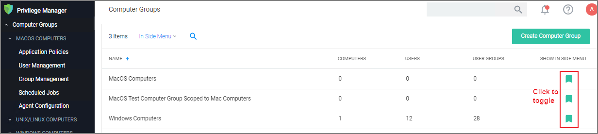

[title]: # (Navigation and Controls)
[tags]: # (menus)
[priority]: # (1)
# Navigation and Controls

In Privilege Manager navigation and controls are aligned with Thycotic's standard user experience.  The main navigation menu is situated along the left side of your browser window and controls on each page are standardized.

The button for a __page refresh__ and the __More__ drop-down options are available at the top-right of your page.

Whenever you are in editing mode on a page, you find a __Save__ or __Cancel__ banner on the top of your page.

Breadcrumb navigation is provided on the top left of your page.

Table column sorting and filtering is available via the ellipsis on each table column:

## Search, Notification, Help, User Menus

Next to the search menu is the [Notification/Alerts](../alert/index.md) icon. Click the icon to Manage Approvals and to view Notifications.

The help menu provides access to About, Getting Started, Documentation, and the API Reference.

The user icon provides access to information about the system name, Preferences, and it has the Logout button.

Controls to enable or disable a setting are unified across the user interface via on/off type switches. Users preferences like number of grid rows and color theme can be specified, these will be applied through the console one edited and saved.

## Pin to Navigation Tree

When computer groups are created, they can be pinned to the navigation tree on the left. Click the bookmark type icon next to the computer group name or on the Computer Groups page to toggle if a group is shown in the side menu.

## Table Grid Contents

On any table grid the user has an option to filter on a what is displayed in the grid and what not. 

| Page | Options |
| ----- | ----- |
| Computer Groups |  |
| Application Policies |  |
| User Policies | 
| Group Policies | Same options as for User Policies |
| Scheduled Jobs | All, Active, Inactive |

## Switches

The UI offers many areas where items or states can be switched from off to on or inactive to active and vice versa.

## Main Menu

The main navigation menu on the left is organized into

* [Computer Groups](../../computer-groups/index.md)
* [Client System Settings](../../platforms/windows/client-system-settings.md)
* [File Inventory](../../file-inventory/index.md)
* [Policy Events](../../policy-events/index.md)
* [Reports](../../reports/index.md)
* [Admin](../../admin/index.md)

### Chevrons

A menu item with a chevron indicates the menu can be opened or closed, depending on chevron direction. For example in the image below the chevron pointing down for macOS computers indicates the item is collapsed.

The chevron pointing up for Windows computers indicates the item is expanded.

## Computer Groups

The listed computer groups all have subitems organized by

* [Application Policies](../../computer-groups/app-control/policies/index.md)
* [User Policies](../../computer-groups/local-security/index.md)
* [Group Policies](../../computer-groups/local-security/index.md)
* [Scheduled Jobs](../../admin/tasks/client/index.md)
* [Agent Configuration](../../agents/index.md)

## Admin Menu

The Admin menu provides access to __Tools__, like

* [Disclose Password](../../admin/tools/pw-disclosure.md)
* [Manage Approvals](../../computer-groups/app-control/examples/approval/helpdesk.md)
* [Offline Approvals](../../computer-groups/app-control/examples/approval/offline-approval.md)

The other available __Admin__ subitems are:

* [Actions](../../admin/actions/index.md)
* [Agents](../../agents/index.md)
* [Config Feeds](../../admin/config-feeds/index.md)
* [Configuration](../../admin/config/index.md)
* [Diagnostics](../../admin/diagnostics/index.md)
* [File Upload](../../admin/file-upload/index.md)
* [Filters](../../admin/filters/index.md)
* [Folders](../../admin/folders/index.md)
* [Import Items](../../admin/import-items/index.md)
* [Licenses](../../admin/tasks/reset-license.md)
* [Personas](../../admin/personas/index.md)
* [Resources](../../admin/resources/index.md)
* [Roles](../../admin/roles/index.md)
* Secret Server - only available if integrated via Foreign Systems
* [Server Logs](../../admin/log-viewer/index.md)
* [Setup](../../install/upgrades/index.md) - only available for On-premises instances
* [Tasks](../../admin/tasks/index.md)
* [Users](../../admin/users/index.md)
