[title]: # (Resource Explorer)
[tags]: # (details)
[priority]: # (1)
# Resource Explorer

The Resource Explorer provides information about any type of resource item in Privilege Manager.

The Resource Explorer provides:

* __Summary__, which contains general information, such as name, description, and modified date for any resource accessed.
* __Known Data__, such as any data known that relates to the resource. This data is different from resource type to resource type. For example, a domain has Global Domain Details and no account details, and a file will have all sorts of information pertaining to the file.
* __Events__ are log-style data entries that are directly related to the resource. For example for discovered files, those are the events that are reported from and endpoint.
* __Associations__, are any associated/related items.

Resources can be deleted from the Resource Explorer page.

>**Note**:
>Only use Delete when you are absolutely sure that you want to delete that resource. Clicking on Delete will delete the current resource record you are viewing.

The Resource Explorer is accessible by either navigating to

* __Admin | More__, selecting the __Resources__ link and expanding the Resources tree drilling down to a named resource to further explore and/or edit.

  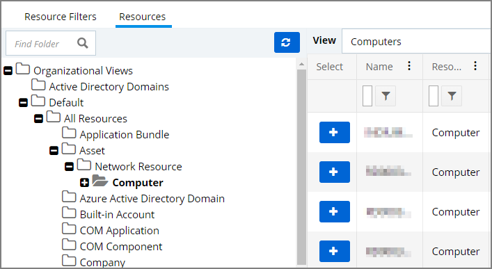

* __Change History__ tab of a named resource.

  

* any named item, such as a report, in the Privilege Manager console and selecting a named resource.

  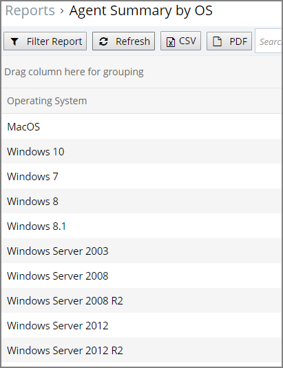

## Example for Discovered Files

You enter the Resource Explorer for discovered file through __Admin | Event Discovery__ and then the __Files__ tile. On the Events page, click any of the discovered file links to drill down to the files resources.

The following image shows all discovered information about the chrome.exe file, such as:

* File Name
* Original File Name
* Product Name
* Version
* Internal Name
* Company Name
* Copyright information
* File Hashes
* View Reputation, if a reputation provider is integrated with your Privilege Manager instance.

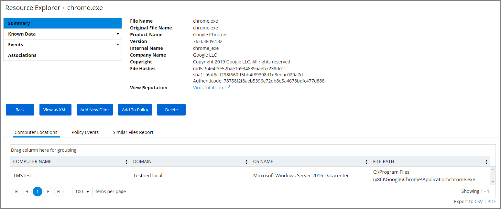

In the bottom section of the explorer page you can look at further details on the __Computer Locations__, __Policy Events__, and __Similar Tiles Report__ tabs.

The __Computer Locations__ tab provides details about the discovery locations where the file was discovered.

The __Policy Events__ tab provides details about the policy events that triggered by the file if executed.

The __Similar Files Report__ tab provides a list of and links to similar files that have been discovered by Privilege Manager.

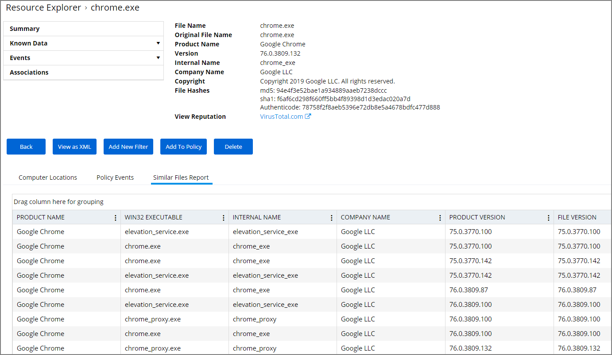

The Known Data for a discovered file includes details like the 

* File Inventory, which provides COFF Header and File Digital Signature data in raw form.

  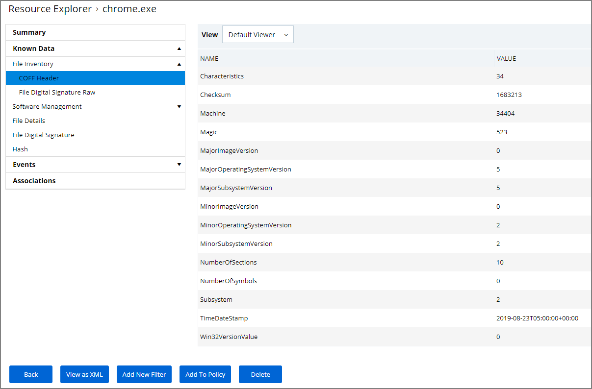

* Software Management, which provides the files Manifest, Version Info in raw form, and Win32 Executables details.

  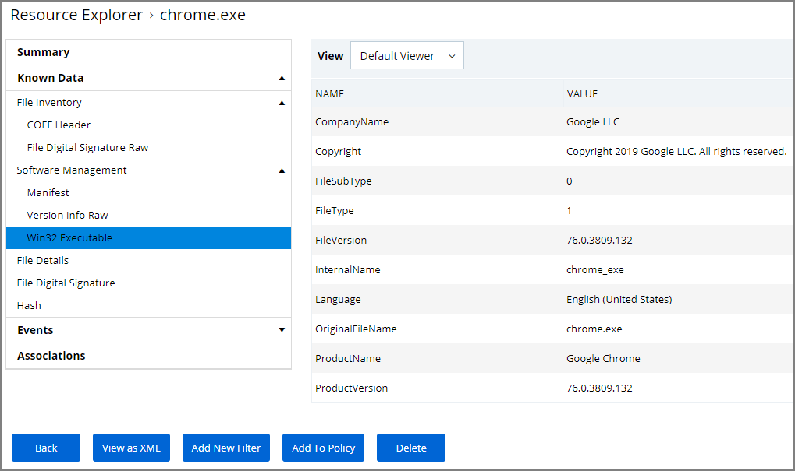

* File Details, such as name, file extension, file size, and if protected or not.
* File Digital Signature, which provided information on the Signer, Countersigner if available, and the signature date/time stamp.
* Hash, provides details on the name, the hash, and hex hash.

Under Events, Infrastructure offers a view into the Resource Discovery events that discovered the file, in this example the File Agent Discoverer and File Agent Discoverer (File Location) events.
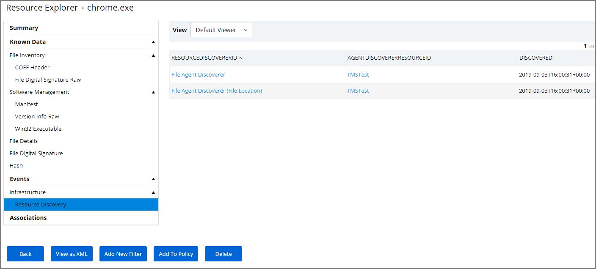

This discovered file resource has no related items associated and thus the Associations area of the Resource Explorer is empty.

## Example for User Resource

When you are looking at change history for any item and click the view user link, you access the __Resource Explorer__ for that specific user resource. The Summary information for that specific user resources shows:

* Name – this is the user account that made the change.
* Created – indicates when the item was created.
* Modified – indicates when the item was last modified.

The resource explorer is providing information about the current state of that user resource.

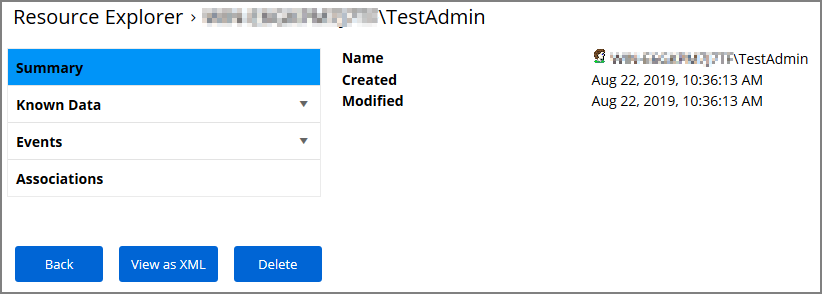

Under __Known Data__ we can explore the information for __Security Management | Global Account Details__.

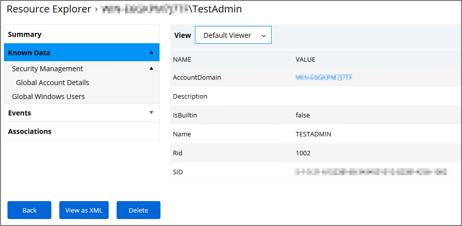

Users can select the View from the drop-down and see information on the type of the resource. User resources provide details about:

* AccountDomain – identifies the domain for the user account.
* Description
* IsBuiltin – can be true false to indicate if the account in built-in or not.
* Name – Name associated with the user account.
* Rid
* SID

Selecting the Global Windows Users information shows Name, Domain, and UserId.

Under __Events__, you can view __Infrastructure | Resource Discovery__
information:

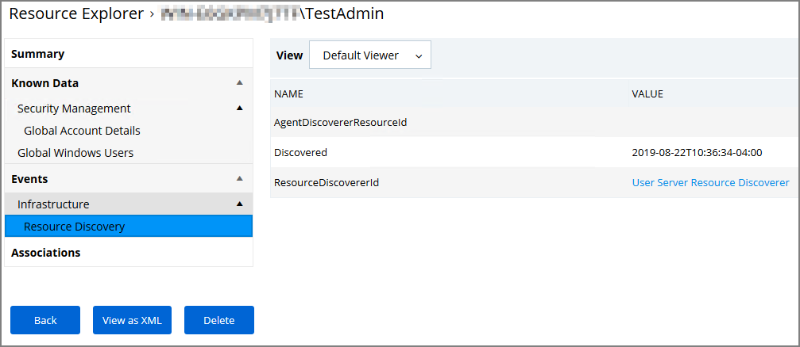

Under __Associations__ you can see related items, such as __Group Membership__, which is based on the users credentials.

## Error Message after Deleting a User Resource

In case a resource was deleted, an error message like the following will be shown the next time the resource view link is accessed.

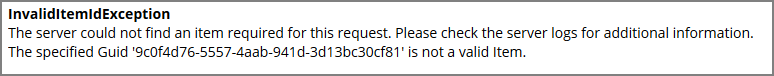
