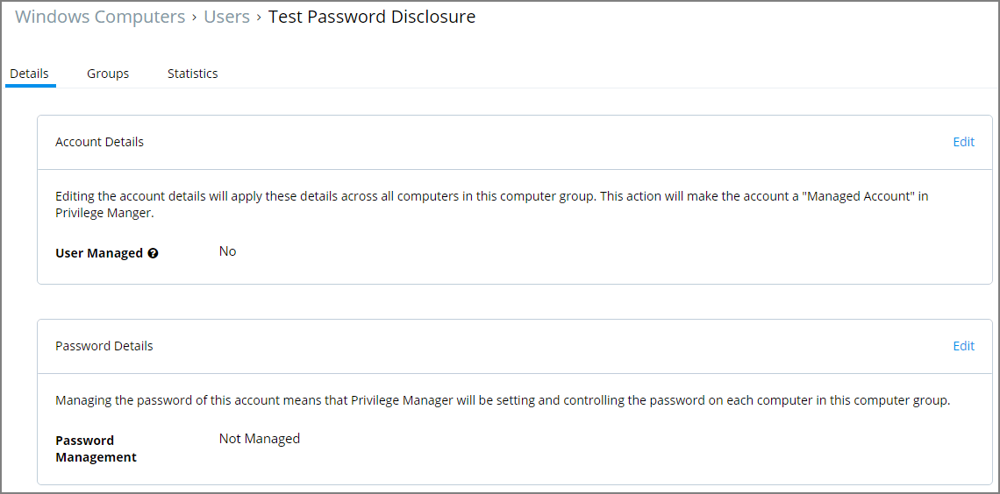

[title]: # (Password Disclosure)
[tags]: # (details)
[priority]: # (2)
# Password Disclosure

The Password Disclosure tool lets users based on role permissions view and manage passwords.

## Setting up Password Management

The following steps guide you through setting up a managed user and enabling password rotation for that user.

1. Navigate to __HOME | Local Security__.
1. From the left navigation frame select __Windows Computers__.
1. Select __Users__.
1. Click __Create User__.
1. Enter a __User Name__ and click __Add User__.

   
1. For Account Details click __Edit__.
1. Select the __User Managed__ checkbox to set the user to be managed.

   
1. Verify information populated in the User Name and Full Name text fields.
1. Click the __Set Password__ button to set-up the initial password.

   
1. Enter the __Initial Password__.
1. Confirm the Password.
1. Click __Save Password__.
1. Click __Save Changes__.
1. For Password Details click __Edit__.

   
1. Select the checkbox for Password Management.

   
1. Confirm that you want to enable password management for the user.

   
1. Specify the details for the password management and establish a password rotation schedule.

   
1. Click Save Changes.

The managed user and password management is now set-up.

## Using the Disclose Password Tool

1. Navigate to __TOOLS | Disclose Password__ or TOOLS and select the __Manage Password__ link.

1. The Computer page opens.

   

   Select a computer from the list.
1. The Password Disclosure page opens, it list the managed users and also provides links to view the current password and to password history. 

   
1. Click on View Password to view the current password.

   
1. Click on View Password History to view the password history.

   

   Select a link on the password history modal to view any of the rotated passwords.

   
