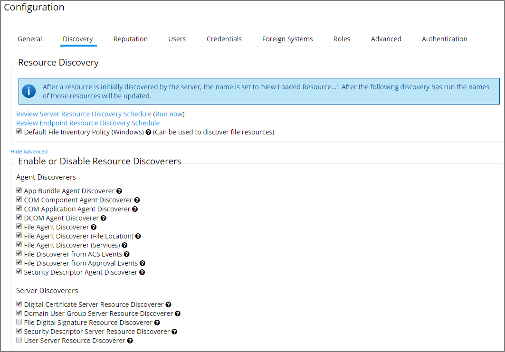

[title]: # (    Discovery Tab)
[tags]: # (admin,configuration)
[priority]: # (2102)
# Discovery Tab

This tab is for resource discovery. After a resource is initially discovered by the server, the name is set to __New Loaded Resource...__. After discovery runs the names of those resources are updated.

Resource Discoverers are selectable under the advanced section. Resource Discoverers are categorized by Agent and Server Discoverers. Most are selected by default and can be disabled by removing the check from the selection box.

