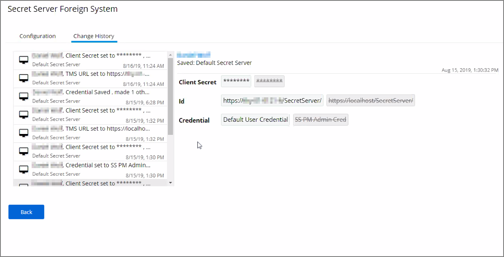
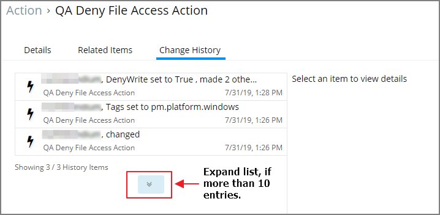
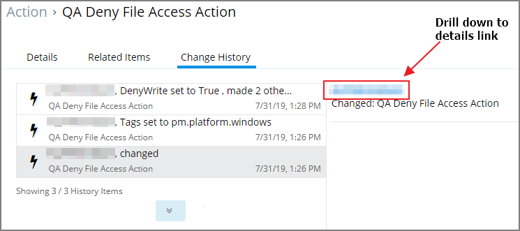
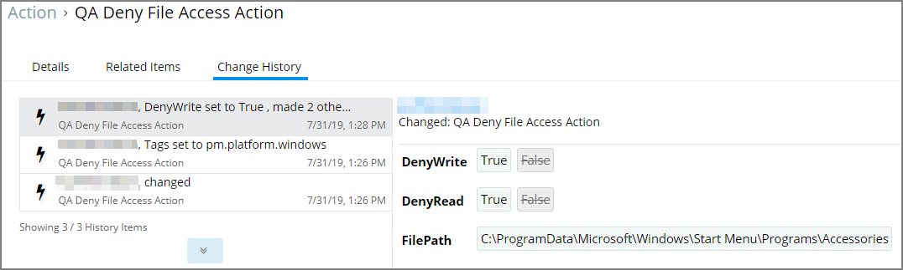
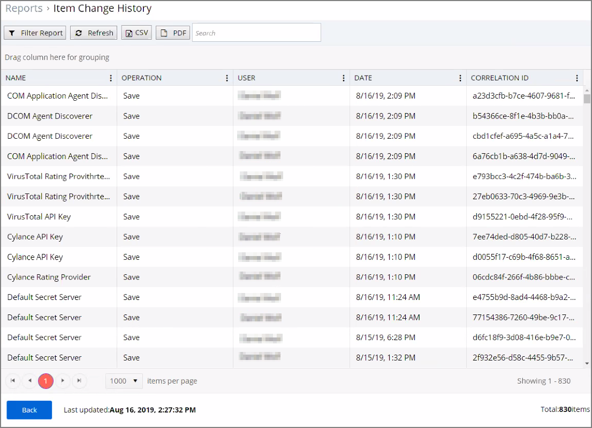

[title]: # (- History Tab)
[tags]: # (user interface,console,overview)
[priority]: # (2110)
# History Tab

The Change History tab is accessible via:

* __Admin | Configuration__ – listing all changes made to Advanced, Discovery, and Reputation item configuration settings.
* __Admin | Policies__ – listing all changes made to policies.
* Admin | More and then
  * __Filters__ – listing all changes made to filters.
  * __Actions__ – listing all changes made to actions.
  * __Resources__ – listing all changes made to resources.
  * __Tasks__ – listing all changes made to tasks.
* __Tools | File Upload__ – listing all file uploads.

Once the tab is selected, it opens a two-column page. On the left all recorded changes are listed with the newest record on top. This left column data provides a summary of the changes:

* what was changed,
* the type of change,
* item changed, and
* date/time of the change.

## Looking at Details

The following image shows an example of the change history for a foreign system entry. The change shows that the foreign system was pointed at another URL.

### Drilling Down

To look at details of any given change, select one of the change entries in the left column. Our example shows changes made to an action. Also,

Looking at the first entry at 1:26 PM, we see that a change occurred. Selecting
the entry provides a summary in the right column providing a further link for
more details.

Using the link, opens the __Resource Explorer__, which defaults to showing
__Summary__ information:

* Name – this is the user account that made the change.
* Created – indicates when the item was created.
* Modified – indicates when the item was last modified.

For this example, we conclude from this change history, that the Action __QA
Deny File Access Action__ is newly created. The down pointing arrows next to
Known Data, Events, and Associations can be expanded to gain more insight into
any given change.

Back at the Change History tab for this action, we select the latest recorded
change from the left column. The change details indicate that DenyWrite and
DenyRead for the action where changed from False to True and we see the
FilePath.

We click the link to access the Resource Explorer. Under __Known Data__ we can
explore the information for __Security Management | Global Account Details__.

Users can select the View from the drop-down and see information on

* AccountDomain – identifies the domain for the user account.
* Description
* IsBuiltin – can be true false to indicate if the account in built-in or not.
* Name – Name associated with the user account.
* Rid
* SID

Selecting the Global Windows Users information shows Name, Domain, and UserId.

Under __Events__, we can see __Infrastructure | Resource Discovery__
information:

Under __Associations__ we can see __Group Membership__:

## Item Change History Report

The __Item Change History Report__ is part of the __Diagnostic__ group on the
Reports page. You can also search for “change history” and the report will be
listed on the search results page. Click the link to access the report.

The report lists the history of item changes.

For further investigation, you can access the item that was changed by clicking the entries in the Name column.
