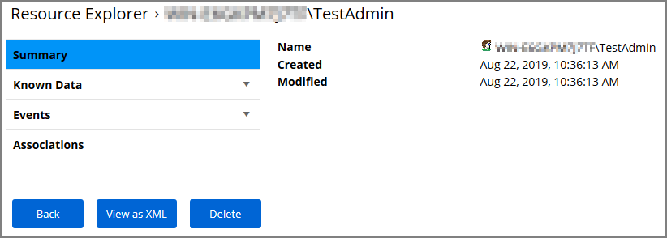
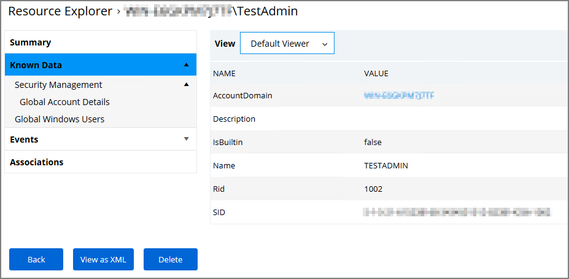

[title]: # (. Resource Explorer)
[tags]: # (details)
[priority]: # (2110)
# Resource Explorer

When you are looking at change history for any item and click the view user link, you access the __Resource Explorer__.
Which defaults to showing __Summary__ information pertaining to that specific user resource:

* Name – this is the user account that made the change.
* Created – indicates when the item was created.
* Modified – indicates when the item was last modified.

The resource explorer is providing information about the current state of that resource.

Under __Known Data__ we can explore the information for __Security Management | Global Account Details__.

Users can select the View from the drop-down and see information on the type of the resource. The type of known data can be different based on resource type, or based on events discovered on endpoints, for example:

* AccountDomain – identifies the domain for the user account.
* Description
* IsBuiltin – can be true false to indicate if the account in built-in or not.
* Name – Name associated with the user account.
* Rid
* SID

Selecting the Global Windows Users information shows Name, Domain, and UserId.

Under __Events__, you can view __Infrastructure | Resource Discovery__
information:

Under __Associations__ you can see related items, such as __Group Membership__, which is based on the users credentials.

>**Note**:
>Only use Delete when you are absolutely sure that you want to delete that resource. Clicking on Delete will delete the current resource record you are viewing.

## Error Message after Deleting a Resource

In case a resource was deleted, an error message like the following will be shown the next the resource view link is accessed.

